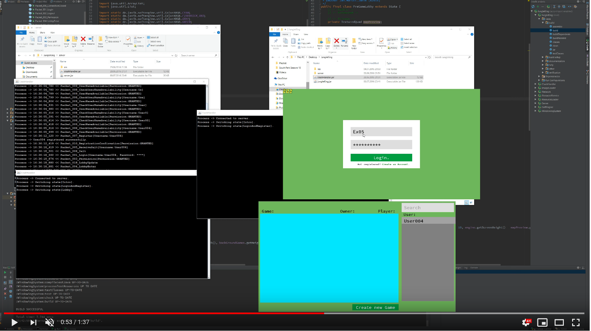

SoftEngine
============

A software based rendering engine which supports:
* Networking (Multiplayer gaming, In-Game chat).
* Custom UI-Elements with transparency (Buttons, Text & Password Fields, Labels & Menus).
* Bitmap based Sprite animation.
* Resource loading (Fonts, Property/Settings files).
* Vast Image loading and manipulation capability.
* User Account creation & login management (via salted & hashed passwords using 'SHA1PRNG' and 'PBKDF2WithHmacSHA256').

Created as part of an Software Engineering exercises.

### Video:
